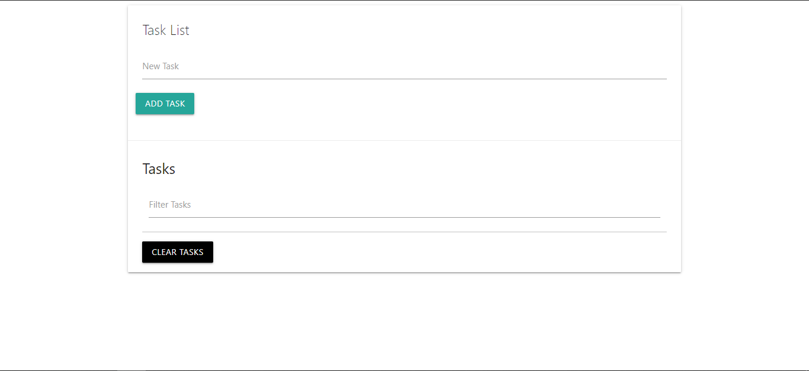
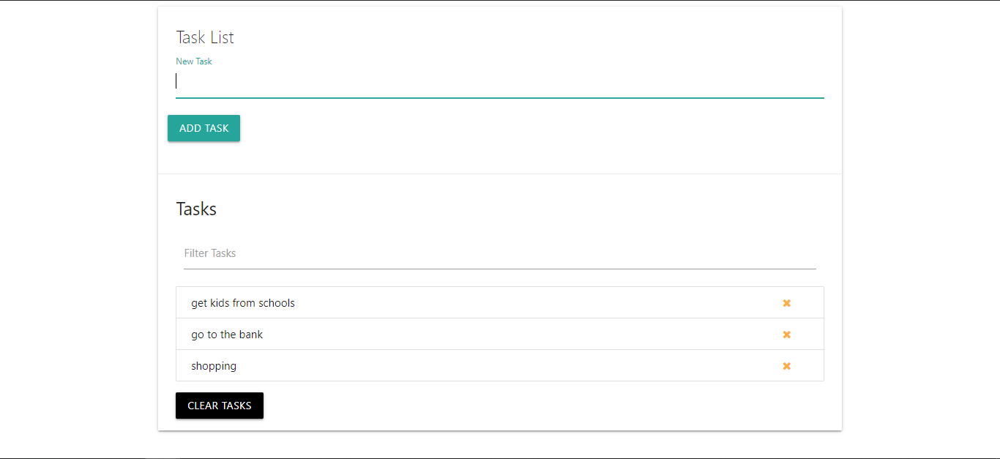
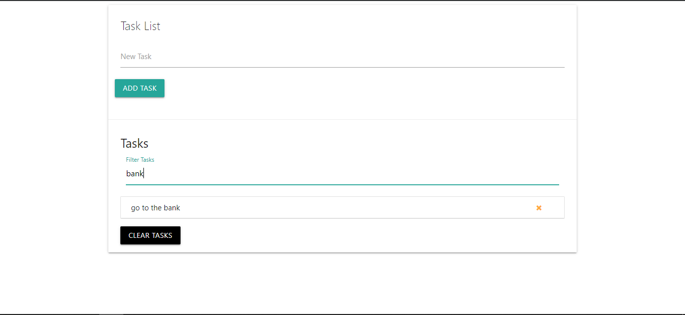

# JavaScript To-Do Web App

This is my first To-Do web app using vanilla JS. NO frameworks or libraries used except for CSS libraries.

## Getting Started

These instructions will get you a copy of the project up and running on your local machine for development and testing purposes.

### Prerequisites

* Just a simple web browser like Firefox is enough with an internet connection to load Css libs from CDN.

### Installing

* Clone the repo and open index.html with your favorite web browser.

## Built With

* Vanilla Javascript
* HTML and CSS (Materialize.css)

## Authors

* **Abdulrahman Elsharqawi**

## License

This project is licensed under the MIT License
